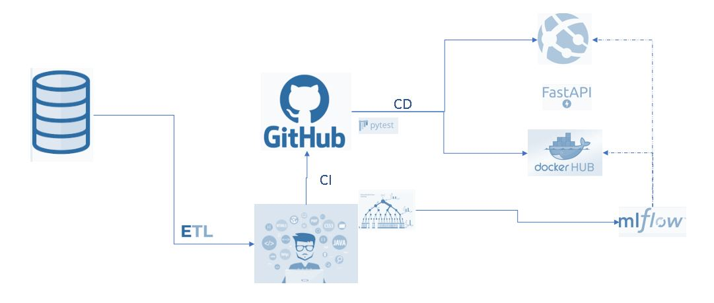

# Detección de Fraudes en Transacciones 

Este proyecto se centra en la detección de fraudes en transacciones  utilizando técnicas de aprendizaje automático y análisis de datos. A continuación, se presenta una descripción general de los pasos y componentes clave del proyecto.

## Descripción General

El objetivo principal de este proyecto es maximizar la ganancia al detectar fraudes en transacciones. Para lograr esto, se buscan equilibrar la precisión y el recall del modelo, con un enfoque particular en la detección de fraudes. A pesar de los desafíos, el resultado final muestra la robustez del modelo y proporciona información valiosa.

## Pasos del Proyecto

- **Transformación de Variables:** Se aplicaron técnicas de transformación de variables para preparar los datos y mejorar su calidad.

- **Depuración de Datos:** Se llevaron a cabo procesos de depuración, incluyendo la eliminación de variables con estructuras deficientes o valores nulos, así como la identificación y eliminación de valores atípicos para mejorar la representatividad de los datos.

- **Selección de Modelos:** Se eligieron modelos de clasificación adecuados para la detección de fraudes y se evaluaron mediante validación cruzada.

- **Afinamiento de Hiperparámetros:** Se realizaron múltiples iteraciones para ajustar los hiperparámetros de los modelos y mejorar su rendimiento.

- **Selección del Punto de Corte:** Se determinó un punto de corte (threshold) en las probabilidades del modelo con el objetivo de maximizar el beneficio, incluso si esto implicaba sacrificar algunos casos de fraude en el proceso (bajo recall).

- **Implementación MlOps:** Se implementó una infraestructura de Machine Learning Operations (MlOps) que incluye integración continua y entrega continua (CI/CD) para el seguimiento de experimentos y la puesta en producción del modelo a través de una API.

- **Exploración de Otras Técnicas:** Se mencionaron otras técnicas que podrían ser exploradas en el futuro, como la relación de nodos con Neo4j, aunque no se pudieron abordar en este proyecto debido a limitaciones de tiempo y datos.

- **Redes Neuronales:** Se experimentó con redes neuronales utilizando Keras, pero no se lograron resultados satisfactorios.

## Estructura del Directorio

- **.gitignore:** Archivo para especificar los archivos y directorios que deben ser ignorados por Git.

- **.github/workflows:** Directorio que contiene archivos de configuración para GitHub Actions.

- **doc:** Directorio que almacena documentación, como el desafío técnico del Data Scientist.

- **mlruns:** Directorio utilizado por MLflow para el seguimiento de experimentos.

- **model:** Directorio que contiene el modelo de LightGBM entrenado.

- **notebook:** Directorio que contiene Jupyter Notebooks utilizados en el proyecto.

- **processed_data:** Directorio que almacena datos procesados, como el archivo CSV resultante.

- **raw_data:** Directorio que contiene el conjunto de datos original.

- **src:** Directorio que contiene código fuente, incluyendo scripts para entrenar modelos y transformar datos.

- **test:** Directorio que contiene pruebas para el modelo y el código fuente.

- **api_model.py:** Archivo que define la API para el modelo.

- **Dockerfile:** Archivo para la creación de una imagen Docker.

- **requirements.txt:** Archivo que especifica las dependencias del proyecto.

## Requisitos

Este proyecto se desarrolló utilizando Python 3.9. Asegúrate de tener instaladas las dependencias listadas en `requirements.txt`.

## Uso

Para ejecutar el proyecto, sigue los pasos a continuación:

1. Clona este repositorio en tu entorno local.
2. Instala las dependencias mediante `pip install -r requirements.txt`.
3. Ejecuta los scripts en el directorio `src` según tus necesidades.

